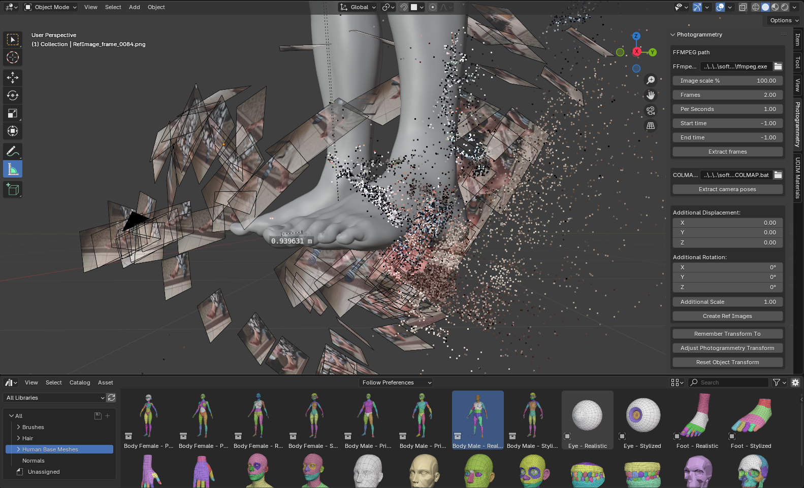
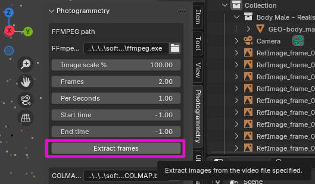
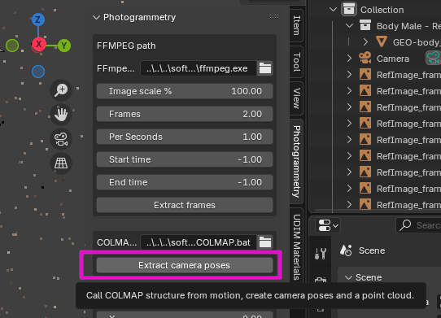
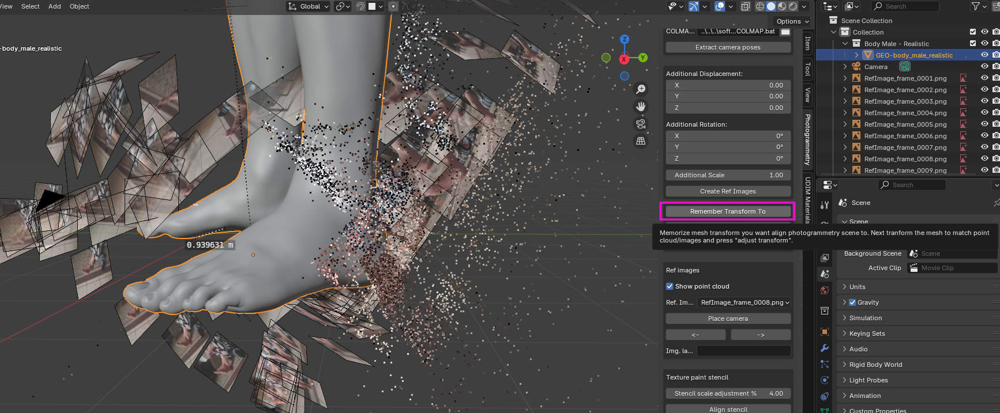
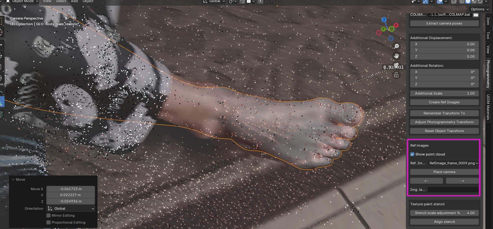
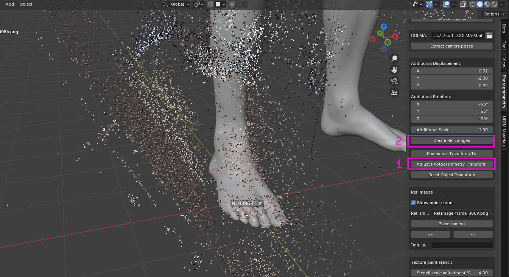
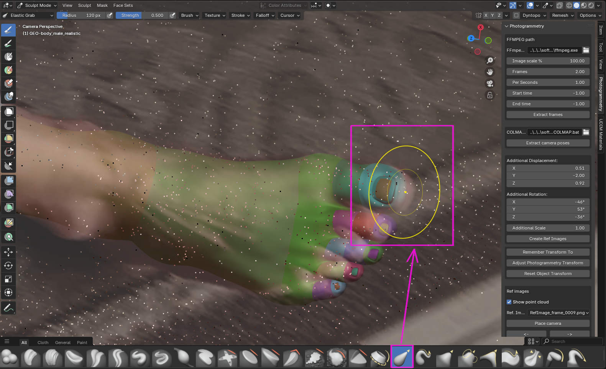
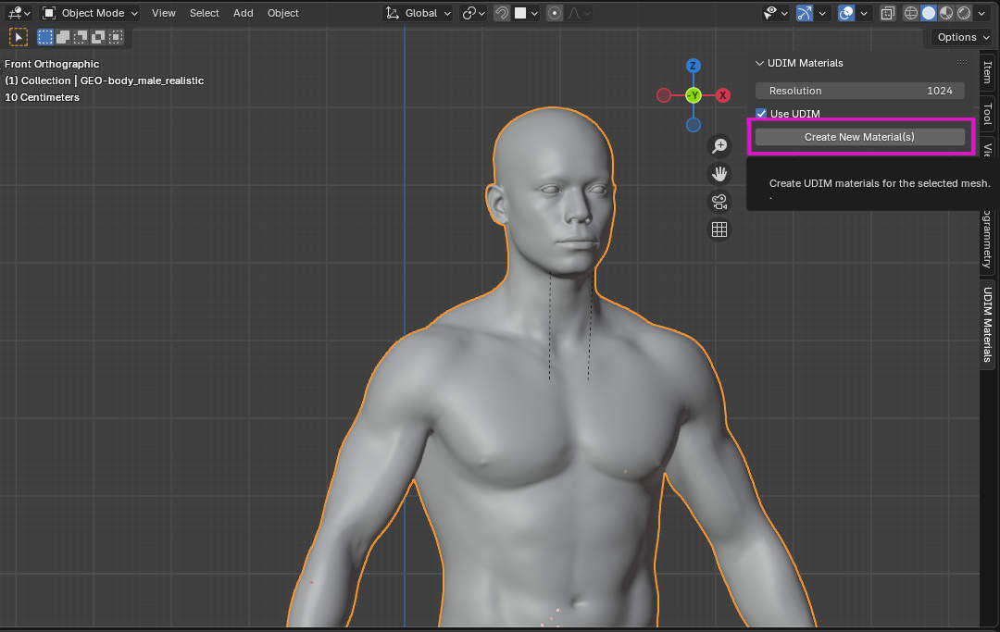
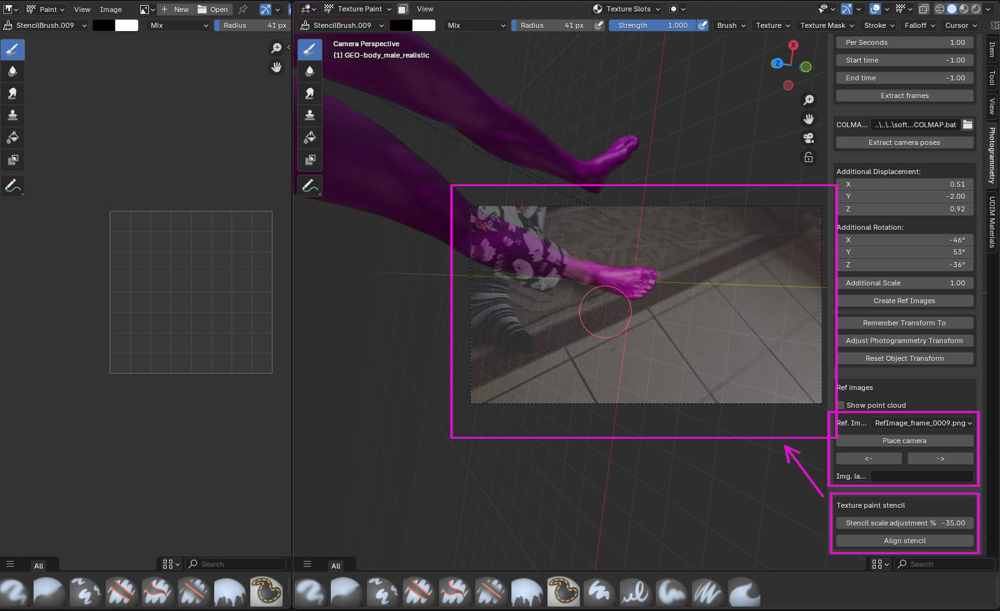

# Not an artist? - Not a problem! Blender Cloning Helper

**No artistic skills? - not a problem! Math can help you create perfect copies of people and objects using a reference video!**

A Blender addon that integrates COLMAP photogrammetry with powerful tools for texture painting, image alignment, and UDIM material creation. Designed to simplify photogrammetry workflows and enable accurate 3D reconstruction from video-derived frames. Inspired by ([Facebuilder](https://keentools.io/products/facebuilder-for-blender)) but made to be usable for any object.

## Features

- COLMAP data import: camera poses, sparse point cloud, and image planes
- Camera alignment: snap Blender's view to a selected reference image
- Stencil texture generation: create a paint-ready texture aligned to reference images
- Automatic UDIM material builder
- Built-in FFmpeg support: extract frames from video input (e.g., phone selfie)

## Usage Workflow

### 1. Capture a video of an object.

For a real world object use your smartphone. Record a video with predominantly overlapping field of view. Try to capture the object from all angles.

For a virtual object in a video game use photo mode. Fly around the object, try capturing the object from all directions. Make overlapping snapshots or a continuous video file.

### 2. Extract video frames using the FFmpeg operator
Use **Photogrammetry** side panel to extract images from a video. If you have image files, place them to "images" folder adjacent to the blender file.

### 3. Reconstruct the scene using COLMAP

Use **Photogrammetry** "Extract camera poses" button to solve for the camera poses and 3d point cloud.

### 4. Save target mesh transform

You need a base mesh. Here in the example it is a base human mesh from "Human Base Meshes" Blender free library. It is necessary to align the camera poses to this base mesh. But it is difficult. Instead, we align the mesh to camera poses and point cloud and then "undo" the transform to both the mesh and the images. It makes the mesh to be in its original pose and camera images aligned to it. But first it is necessary to memorize the mesh transform we want to align camera images to. Press "Remember Transform To".

### 5. Align the object to images and the point cloud.

At this step it is necessary to align the object to the point cloud and camera images. Use grab, rotate and scale transforms to align the mesh to the images and the point cloud. 

Use the check box to visualize the point cloud. Point cloud is convenient for the initial coarse alignment. Then, select individual camera images and do fine alignment.

### 6. Adjust transform.

Now, when the object is aligned to the point cloud and camera images, we can undo the transform we had to apply. Click "Adjust Photogrammetry Transform" to return the mesh to its memorized pose. Then, click "Create Ref Images" to recreate images and the point cloud using the new align transform.

### 7. Sculpt the mesh to match outlines in all camera views.

Now, when the mesh is in its original pose and all camera images are aligned, use sculpting "elastic grab" brush to match mesh outline with all camera views.

### 8. Create materials (optional step)

If the base mesh you use doesn't have materials, use "UDIM materials" panel to create a set of UDIM materials. The tool analyzes all UV coordinates and creates UDIM material tiles automatically based on where all vertices are located in UV plane.

### 9. Texture paint the object using automatic stencil image tool.

Use aligned camera views in texture paint mode and "Align stencil" button to create a texture paint stencil textured aligned with camera views. Unfortunatelly, in Blender I only can reliably position the stencil texture but not always scale it precisely. It might be a bug in Blender itself. For that use "Stencil scale adjustment" edit together with "Align stencil" button. As soon as image and stencil image outlines match, you can start texture painting. 

Switch camera views and use "Align stencil" to paint different parts of the object.

## Installation

1. Download or clone this repository
2. In Blender, go to Edit > Preferences > Add-ons > Install
3. Select the zip file or source folder, then enable the addon

## Requirements

- Blender 4.3.2 or higher
- COLMAP - you need to specify the full path to COLMAP.bat
- FFmpeg - full path to ffmpeg.exe

## TODO

- [ ] Convert to addon.
- [X] Add a simple to follow usage tutorial.

## License

It is free to use, I guess. But please reference this webpage as a sign of courtesy.

## Credits

Created by me ([GitHub](https://github.com/z80/blender_cloning_helper)) to ease 3D reconstruction workflows in Blender for non-artists.
